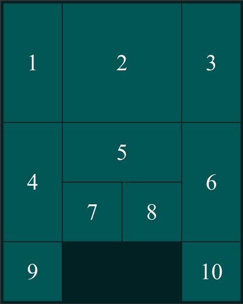

# Sliding Block Puzzle

The origin of this puzzle and different names of it is discussed in https://en.wikipedia.org/wiki/Klotski

### The starting position looks as following:

### The goal is to move block 2 to the bottom line

## Copyright and License

Copyright 2023 Oleksandr Solontsov. Code released under [the MIT License](./LICENSE.txt).
